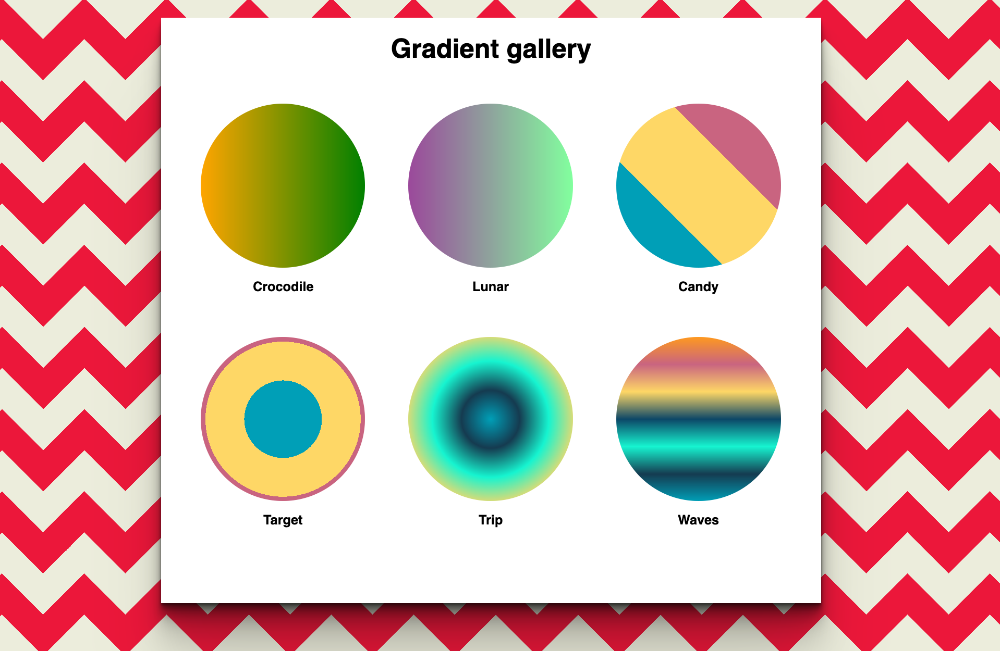

# Gradient gallery

Showcase at least 6 different gradient combinations trying to recreate
something similar to the mockup below.

1. For displaying the gradients, try to use a `<ul>` element, so that each
   gradient is a `<li>`
1. for the background of the whole page, you can simply copy one gradient from here http://projects.verou.me/css3patterns/
1. don't worry if the page is not responsive, just pay attention to put a good amount of margin between each element

